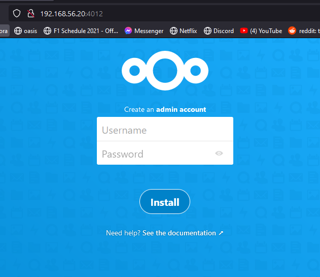
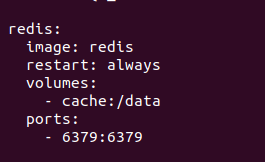
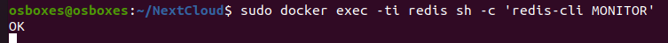
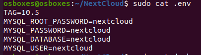
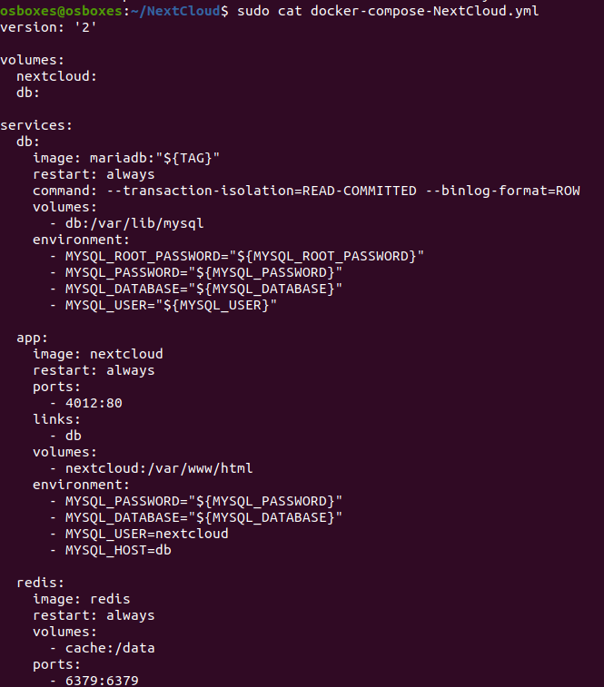

# docker deel 2

## stap 1 : installatie NextCloud

make directory NextCloud

```
mkdir NextCloud
```

enter dir

```
cd NextCloud
```

make .yml file

```
sudo nano docker-compose-NextCloud.yml
```

### Base version - apache

```version: '2'

volumes:
  nextcloud:
  db:

services:
  db:
    image: mariadb:10.5
    restart: always
    command: --transaction-isolation=READ-COMMITTED --binlog-format=ROW
    volumes:
      - db:/var/lib/mysql
    environment:
      - MYSQL_ROOT_PASSWORD=
      - MYSQL_PASSWORD=
      - MYSQL_DATABASE=nextcloud
      - MYSQL_USER=nextcloud

  app:
    image: nextcloud
    restart: always
    ports:
      - 8080:80
    links:
      - db
    volumes:
      - nextcloud:/var/www/html
    environment:
      - MYSQL_PASSWORD=nextcloud
      - MYSQL_DATABASE=nextcloud
      - MYSQL_USER=nextcloud
      - MYSQL_HOST=db
```

start de service op

```
sudo docker-compose -f docker-compose-NextCloud.yml up
```


> ERROR - zie bijlage

> solved


_apache2 -D FOREGROUND zichtbaar_

**in browser**



## Stap 2: Commando’s uitvoeren in een container

**voeg redis toe aan docker-compose-NextCloud.yml**



```
sudo docker exec -ti redis sh -c 'redis-cli MONITOR'
```



> result == ok

## Stap 3: Environment variab les

maak een `.env` bestand

```
sudo nano .env
```



**haal de gevoelig DATA uit het .yml bestand**



## bijlage

```
sudo docker ps
```


**adress already in use**

```
sudo ufw status
```


allow new port

```
sudo ufw allow 4012
```


**change port in .yml**


